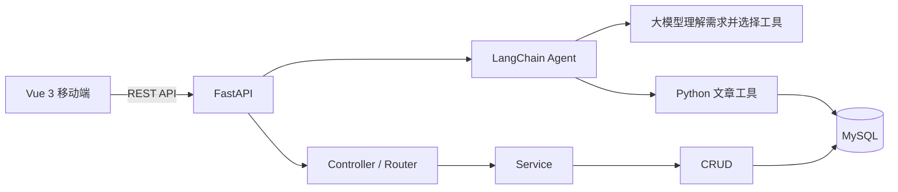

# 新闻资讯全栈应用Demo

一个面向移动端的前后端分离新闻应用。后端基于 FastAPI 提供异步 REST API，前端使用 Vue 3、Vant 和 Pinia，实现新闻浏览、分类筛选、用户登录、收藏、浏览历史、主题切换、中英文切换，以及基于 LangChain 的文章聊天助手。通过自然语言即可查询、新建、修改和删除现有文章。


## 功能特性

- 新闻分类、分页列表、详情和同类新闻推荐
- 新闻浏览量统计
- 用户注册、登录、资料编辑和密码修改
- 新闻收藏、取消收藏、收藏列表和一键清空
- 浏览历史记录、单条删除和一键清空
- Pinia 状态管理及本地持久化
- 浅色、深色、蓝色、绿色四种主题
- 中文、英文界面切换
- LangChain 文章助手：聊天完成文章增删改查，显示实际工具执行记录
- FastAPI 自动生成 Swagger 和 ReDoc 接口文档
- SQLAlchemy 异步访问 MySQL，支持 Alembic 自动迁移
- 新闻分类、列表、详情和推荐直接查询 MySQL

## 技术栈

| 层级 | 技术 |
| --- | --- |
| 前端 | Vue 3、Vite 7、Vue Router、Pinia、Vant 4、Axios、Vue I18n |
| 文章助手 | LangChain create_agent、langchain-openai、支持工具调用的兼容模型、Marked、DOMPurify |
| 后端 | Python 3.14、FastAPI、Uvicorn、Pydantic Settings |
| 数据访问 | SQLAlchemy 2 Async、aiomysql、Alembic |
| 数据存储 | MySQL 8 |
| 包管理 | uv、npm |

## 系统架构



后端按 `Controller -> Service -> CRUD -> Model` 分层。统一业务接口前缀为 `/api`，成功响应采用以下结构：

```json
{
  "code": 200,
  "message": "success",
  "data": {}
}
```

## 项目结构

```text
.
├─ app/
│  ├─ api/v1/                 # API 路由汇总
│  ├─ common/                 # 统一响应结构
│  ├─ core/                   # 配置、数据库、异常处理
│  ├─ modules/
│  │  ├─ agent/               # 聊天接口、简单 Agent、文章操作工具
│  │  ├─ news/                # 新闻分类、列表和详情
│  │  ├─ favorite/            # 用户收藏
│  │  ├─ history/             # 浏览历史
│  │  └─ system/user/         # 注册、登录和用户资料
│  └─ utils/                  # 鉴权和密码工具
├─ alembic/                   # 数据库迁移
├─ env/.env.example           # 后端配置模板
├─ frontend/xwzx-news/        # Vue 前端项目
│  └─ src/
│     ├─ components/          # 公共组件
│     ├─ config/              # API 配置
│     ├─ i18n/                # 中英文文案
│     ├─ router/              # 前端路由
│     ├─ store/               # Pinia Store
│     └─ views/               # 页面组件
├─ static/news_app.sql        # 完整表结构和演示数据
├─ main.py                    # FastAPI 入口
├─ docs/Agent入门.md          # 中文入门教程
├─ tests/                     # 临时数据库与假模型测试
├─ requirements.txt           # 锁定版本的完整 Python 依赖
├─ pyproject.toml             # Python 项目与依赖配置
└─ test_main.http             # 基础接口请求示例
```

## 快速开始

### 1. 环境要求

- Python 3.14+
- [uv](https://docs.astral.sh/uv/)（推荐）
- Node.js `^20.19.0` 或 `>=22.12.0`
- MySQL 8.0+

### 2. 获取项目

```bash
git clone <your-repository-url>
cd fast-api-getting-started-demo-main
```

### 3. 配置后端

首次安装且没有 `env/.env.dev` 时复制配置模板；已有配置请直接编辑，保留原数据库信息：

```powershell
# Windows PowerShell
Copy-Item env\.env.example env\.env.dev
```

```bash
# macOS / Linux / Git Bash
cp env/.env.example env/.env.dev
```

打开 `env/.env.dev`，至少填写本机 MySQL 密码：

```dotenv
DATABASE_HOST=localhost
DATABASE_PORT=3306
DATABASE_USER=root
DATABASE_PASSWORD=your_database_password
DATABASE_NAME=news_app
DATABASE_AUTO_MIGRATE=true
```

项目通过 `ENVIRONMENT` 选择配置文件，默认值为 `dev`，对应 `env/.env.dev`。

### 4. 导入演示数据库

已有数据库时跳过此步。首次体验可导入 `static/news_app.sql`，其中包含建表和清表语句，请只导入全新的演示库。该文件包含完整的 8 张表、8 个新闻分类和 400 余条演示新闻，可直接体验全部功能。

```bash
mysql -u root -p -e "CREATE DATABASE IF NOT EXISTS news_app CHARACTER SET utf8mb4 COLLATE utf8mb4_unicode_ci;"
mysql -u root -p news_app < static/news_app.sql
```

Windows PowerShell 可使用：

```powershell
mysql -u root -p -e "CREATE DATABASE IF NOT EXISTS news_app CHARACTER SET utf8mb4 COLLATE utf8mb4_unicode_ci;"
Get-Content -Raw -Encoding UTF8 .\static\news_app.sql | mysql -u root -p news_app
```

> 直接启动一个空数据库时，Alembic 当前只会创建新闻分类、新闻、用户和令牌四张核心表。收藏与浏览历史依赖 SQL 文件中的表结构，因此体验完整功能时请先导入演示数据库。

### 5. 启动后端

```bash
uv sync --locked
uv run --locked python -m uvicorn main:app --reload
```

启动后可访问：

- 服务地址：<http://127.0.0.1:8000>
- Swagger：<http://127.0.0.1:8000/docs>
- ReDoc：<http://127.0.0.1:8000/redoc>

也可以使用 `python -m pip install -r requirements.txt` 安装依赖，再运行 `python -m uvicorn main:app --reload`。Windows 用户可以双击根目录 `start-backend.cmd` 和 `start-frontend.cmd`。

应用启动时会检查数据库结构，并在 `DATABASE_AUTO_MIGRATE=true` 时自动执行尚未应用的 Alembic 迁移。

### 6. 配置并启动前端

```bash
cd frontend/xwzx-news
npm install
npm run dev
```

浏览器访问终端输出的地址，默认通常为 <http://localhost:5173>。前端后端地址目前配置在 `frontend/xwzx-news/src/config/api.js`，默认连接 `http://127.0.0.1:8000`。

### 7. 配置文章助手

在后端 `env/.env.dev` 中填写支持工具调用的模型配置，修改后重启后端：

```dotenv
LLM_API_KEY=your_api_key
LLM_BASE_URL=https://dashscope.aliyuncs.com/compatible-mode/v1
LLM_MODEL=qwen-plus
```

默认示例使用 DashScope，也可以替换为其他 OpenAI 兼容服务；所选模型必须支持工具调用（tool calling）。密钥只保存在后端。未配置时，文章浏览和登录仍可使用，聊天页面会显示提示。

登录账号后，在底部进入“文章助手”（`/aichat`）。这是共享文章库教学项目，已登录账号可以管理现有 `news` 表中的文章。可以这样练习：

- `查找包含 FastAPI 的文章，列出文章 ID 和标题。`
- `先查看有哪些分类，选择合适的分类创建一篇《我的学习笔记》，介绍 FastAPI 和 LangChain。`
- `把刚创建的文章标题改为《Agent 入门笔记》，保留正文。`
- `删除刚创建的那篇学习笔记。`

目标不明确时助手先查找或询问，目标明确且用户要求删除时直接执行。每次回复可展开“查看执行过程”，查看实际调用的工具、参数与结果。修改后首页同步刷新。

实现只有一个 Agent、一个模型、6 个工具，没有引入向量库、多 Agent 或独立聊天数据库。为了便于新手跟踪流程，采用一次请求返回完整结果。刷新或离开聊天页会清空本页对话，已保存的文章仍保留。

阅读顺序：`app/modules/agent/controller.py` → `service.py` → `tools.py`。代码带中文注释，详细教程见 [Agent 入门](docs/Agent入门.md)。

## API 概览

### 公共接口

| 方法 | 地址 | 说明 |
| --- | --- | --- |
| `GET` | `/` | 服务状态 |
| `GET` | `/api/agent/status` | 模型是否已配置（不代表连接已验证） |
| `GET` | `/api/news/categories` | 获取新闻分类 |
| `GET` | `/api/news/list` | 按分类分页获取新闻 |
| `GET` | `/api/news/detail` | 获取新闻详情和相关推荐 |
| `POST` | `/api/user/register` | 用户注册 |
| `POST` | `/api/user/login` | 用户登录 |

### 登录后接口

下列接口需要请求头 `Authorization: Bearer <token>`。后端也兼容直接传递 token。

| 方法 | 地址 | 说明 |
| --- | --- | --- |
| `POST` | `/api/agent/chat` | 自然语言操作文章，返回回答和工具日志 |
| `GET` | `/api/user/info` | 获取当前用户资料 |
| `PUT` | `/api/user/update` | 修改用户资料 |
| `PUT` | `/api/user/password` | 修改密码 |
| `GET` | `/api/favorite/check` | 检查收藏状态 |
| `POST` | `/api/favorite/add` | 添加收藏 |
| `DELETE` | `/api/favorite/remove` | 取消收藏 |
| `GET` | `/api/favorite/list` | 获取收藏列表 |
| `DELETE` | `/api/favorite/clear` | 清空收藏 |
| `POST` | `/api/history/add` | 添加浏览记录 |
| `GET` | `/api/history/list` | 获取浏览历史 |
| `DELETE` | `/api/history/delete/{news_id}` | 删除一条浏览记录 |
| `DELETE` | `/api/history/clear` | 清空浏览历史 |

更完整的参数、响应模型和在线调试入口请查看 Swagger；仓库中的 `test_main.http` 也提供了基础请求示例。

## 数据库说明

演示 SQL 包含以下数据表：

| 表名 | 用途 |
| --- | --- |
| `news_category` | 新闻分类 |
| `news` | 新闻内容 |
| `user` | 用户资料 |
| `user_token` | 登录令牌 |
| `favorite` | 用户收藏 |
| `history` | 浏览历史 |
| `related_news` | 相关新闻关系 |
| `ai_chat` | AI 聊天记录预留表 |

聊天页面只请求本项目后端，由 LangChain 调用模型和文章工具。对话历史随请求传入，尚未写入 `ai_chat` 表；相关新闻由后端按相同分类动态查询。分类、列表和详情直接查询 MySQL。

## 常用命令

```bash
# 后端开发
uv run --locked python -m uvicorn main:app --reload

# 手动升级数据库
uv run --locked python -m alembic upgrade head

# 生成迁移文件（修改 ORM Model 后）
uv run --locked python -m alembic revision --autogenerate -m "describe change"

# 后端测试（临时 SQLite 数据库和假模型，不消耗模型额度）
uv run --locked python -m pytest -q

# 前端开发与构建
cd frontend/xwzx-news
npm run dev
npm run build
npm run preview
```

## 部署注意事项

- 不要提交 `env/.env.dev`、`.env.local`、`tmp_token.txt` 或任何真实密钥，仓库已在 `.gitignore` 中忽略这些文件。
- 模型密钥由后端读取，前端环境变量仅设置 `VITE_API_BASE_URL`；不要将密钥放进浏览器代码。
- 生产环境请关闭 `DEBUG` 和 `DATABASE_ECHO`，并将 `CORS_ORIGINS` 设置为明确的前端域名。
- 部署时通过前端 `VITE_API_BASE_URL` 指定后端地址。
- 自动化测试使用真实 LangChain 工具循环、可控假模型和临时 SQLite，不操作现有 MySQL 数据。真实模型还需配置自己的 Key 后验证。
- 当前所有已登录用户共享文章编辑权限，是教学设定；正式多用户服务需要补充角色和文章归属权限。


